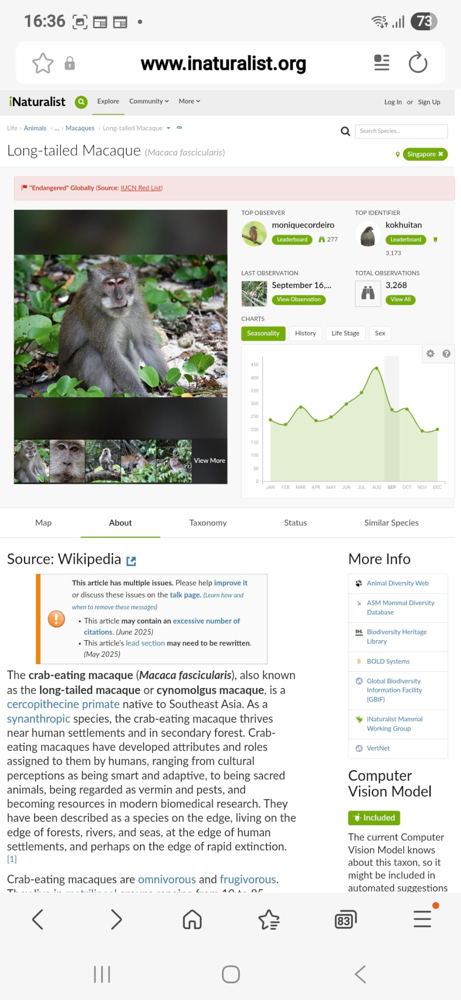

# ThroughMyLens
This website documents the places I have been to conduct my photo-taking adventures in the beautiful NParks in Singapore. I have included citizen surveys I have done using iNaturalist of the mammals and birds I have done.

This is what have collected in my profile in iNaturalist, a mobile app used recording an encounter with an individual organism at a particular time and location, so far from 2024 to 2025.

To understand the data, we found that there are 

