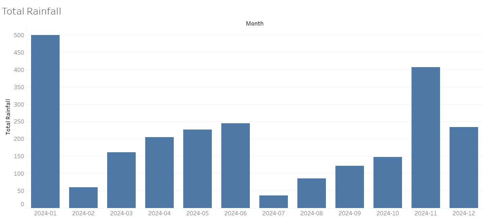

# ThroughMyLens
This website documents the places I have been to conduct my photo-taking adventures in the beautiful NParks in Singapore. I have included citizen surveys I have done using iNaturalist of the mammals and birds I have done.

This is what have collected in my profile in iNaturalist, a mobile app used recording an encounter with an individual organism at a particular time and location, so far from 2024 to 2025. I have collected 68 observations of 48 species of wildlife anamals and birds.

To understand the data, we found that there are many observations of the long tail macaques in the database of iNaturalist app. There is a strong correlation between the best months to visit Singapore, which is between February and March, between June and August, which is the dry and sunny weather in Singapore, perfect for taking long walks in the NParks to look for wildlife.

The total rainfall of 2024 from NEA shows that there is a very low point, and rising from February to March and July to August 2024. This suggests that dryer weather from March 2024 to April 2024, Jul to August 2024 helps to bring people out to walk and do some bird survey tasks

